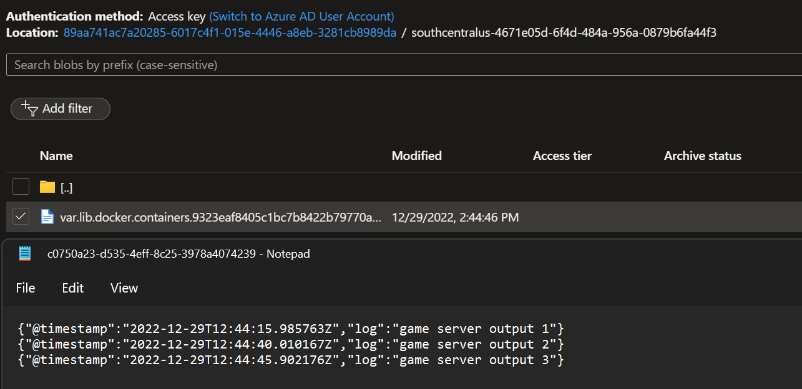

# Linux logs with Fluent Bit and Azure Blob Storage

## Introduction

[Fluent Bit](https://github.com/fluent/fluent-bit) is an open source and multi-platform Log Processor and Forwarder which allows you to collect data/logs from different sources, unify and send them to multiple destinations. Fluent Bit is lightweight with a small memory footprint and very efficient in terms of CPU usage.

[Azure Blob Storage](https://azure.microsoft.com/en-us/services/storage/blobs/) is a service for storing large amounts of unstructured object data, such as text or binary data. Blob storage is optimized for storing massive amounts of unstructured data.

## What it does

This script uses [Fluent Bit](https://github.com/fluent/fluent-bit) to grab logs from Linux containers running in real time on the Virtual Machine and send them to an [Azure Blob Storage](https://azure.microsoft.com/en-us/services/storage/blobs/) account. This script is applicable if you are running Linux MPS Builds using Linux containers for your game servers.

## Usage

You should [create an Azure Storage account](https://learn.microsoft.com/en-us/azure/storage/common/storage-account-create?tabs=azure-portal). After that, you [should grab the connection details using the docs here](https://learn.microsoft.com/en-us/azure/storage/common/storage-account-keys-manage?tabs=azure-portal) and add the storage account name and the shared key to the config.conf file.

You can read the [documentation to learn how to configure the Azure Blob output plugin](https://docs.fluentbit.io/manual/pipeline/outputs/azure_blob). By default the script creates a text blob in a container named `<titleID>_<buildID>_<region>` on a path named with the last part of the vmID.

Then, create a zip file with the following contents:

- config.conf
- PF_StartupScript.sh file
- fluent-bit binary (recommended to add it to the .zip file and install it from the script, for better performance)

You can now create a new MPS Build with your startup script using the [instructions here](https://learn.microsoft.com/en-us/gaming/playfab/features/multiplayer/servers/vmstartupscript).

