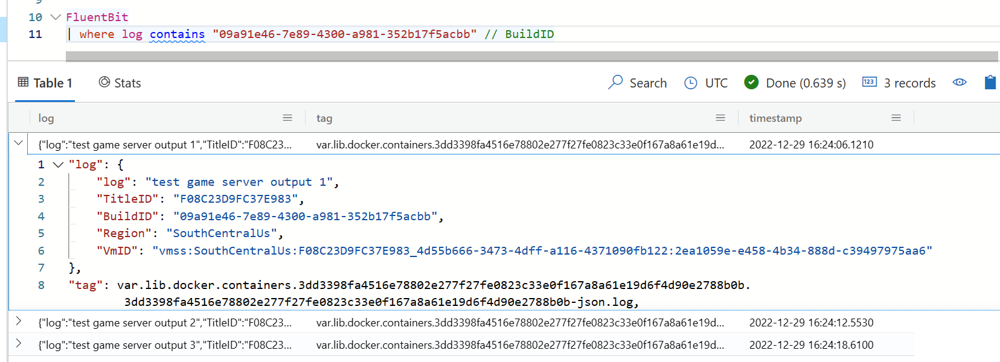

# Linux logs with fluentbit and Azure Data Explorer (Kusto)

## Introduction

[Fluent Bit](https://github.com/fluent/fluent-bit) is an open source and multi-platform Log Processor and Forwarder which allows you to collect data/logs from different sources, unify and send them to multiple destinations. Fluent Bit is lightweight with a small memory footprint and very efficient in terms of CPU usage.

[Azure Data Explorer (Kusto)](https://azure.microsoft.com/en-us/products/data-explorer/) is a fast, fully managed data analytics service that makes it easy to explore massive amounts of data at interactive speed using either a serverless or provisioned option. It is purpose-built for log analytics, application monitoring, infrastructure monitoring, and cybersecurity.

## What it does

This script grabs real-time logs from all containers running on the VM and sends them to Azure Data Explorer. Moreover, this script is applicable if you are running Linux MPS Builds using Linux containers for your game servers.

## Usage

You should the documentation for [Fluent Bit Azure Data Explorer plugin](https://docs.fluentbit.io/manual/pipeline/outputs/azure_kusto) to learn more about the steps you need to do, specifically:

- Create a Kusto cluster and database to store the data ([click here for a free cluster](https://dataexplorer.azure.com/freecluster))
- Create an Azure Registered Application so that fluentbit can authenticate to the cluster
  - [Register an application](https://docs.microsoft.com/en-us/azure/active-directory/develop/quickstart-register-app#register-an-application)
  - [Add a client secret](https://docs.microsoft.com/en-us/azure/active-directory/develop/quickstart-register-app#add-a-client-secret)
  - [Authorize the app in the database](https://docs.microsoft.com/en-us/azure/data-explorer/kusto/management/access-control/principals-and-identity-providers#azure-ad-tenants)
    - During our tests, it wasn't clear if adding the service Principal in the table "users" was enough, or if it was also necessary to add it in the table "ingestors" or "admins"

```kql
// Azure AD App on your tenant tenant - by tenant ID
.add database MyDatabase admins ('aadapp=<servicePrincipalApplicationID>;<tenantID>') 'Test app for fluentbit'
```

- Create a table in the database to store the data

```kql
.create table FluentBit (log:dynamic, tag:string, timestamp:datetime)
```

You should grab the service Principal credentials (application/client ID, tenant ID and client secret) and apply them on config.conf to configure the plugin. You should add the Kusto cluster and database name on the same file.

Then, create a zip file with the following contents:

- config.conf
- PF_StartupScript.sh file
- fluent-bit assets (highly recommended)

You can now create a new MPS Build with your startup script using the [instructions here](https://learn.microsoft.com/en-us/gaming/playfab/features/multiplayer/servers/vmstartupscript).


