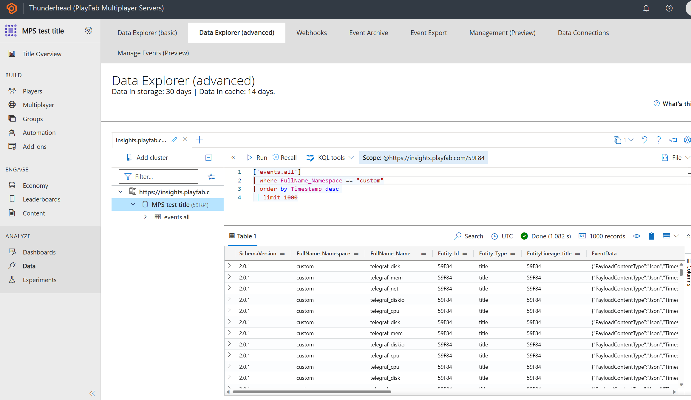
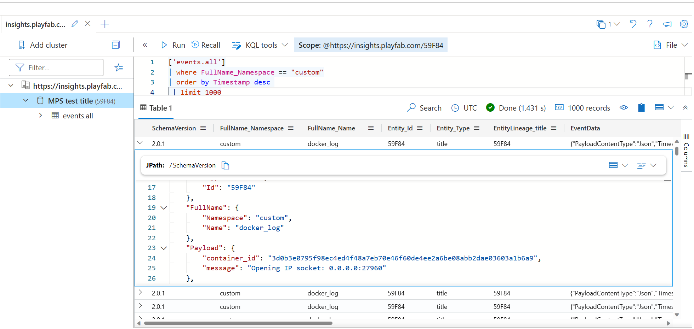

# Linux metrics with telegraf and PlayFab Insights

## Introduction

[Telegraf](https://github.com/influxdata/telegraf) is a plugin-driven server agent for collecting and reporting metrics. It supports a wide variety of inputs, processors, aggregators, and outputs.

[PlayFab Insights](https://learn.microsoft.com/en-us/gaming/playfab/features/insights/) is a completely managed data environment, giving you instant access to your games data without the need for additional engineering. Unlike other hosted data solutions, Insights requires no setup, no GDPR work, and no extra engineering.

You can see documentation about [Telegraf output plugin for PlayFab Insights here](https://github.com/dgkanatsios/telegraftoplayfabinsights). This plugin is an [external Telegraf plugin](https://github.com/influxdata/telegraf/blob/master/docs/EXTERNAL_PLUGINS.md).

## What it does

This recipe uses [Telegraf](https://www.influxdata.com/time-series-platform/telegraf/) agent to capture and send VM performance metrics (CPU/Disk/Memory/Network) to PlayFab Insights and/or logs from containers running on the VM (which includes your game servers). The Telegraf agent uses the [execd output plugin](https://github.com/influxdata/telegraf/blob/master/plugins/outputs/execd/README.md) to launch the [external plugin](https://github.com/dgkanatsios/telegraftoplayfabinsights) which uses the [Write Telemetry Events](https://learn.microsoft.com/en-us/rest/api/playfab/events/play-stream-events/write-telemetry-events?view=playfab-rest) API to send custom events to PlayFab Insights.

## Usage

You should download Telegraf from the [GitHub releases](https://github.com/influxdata/telegraf/releases) section. The [Debian amd64 package](https://dl.influxdata.com/telegraf/releases/telegraf_1.24.4-1_amd64.deb) works with this sample.

You should also download `telegraftoplayfabinsightslinux.zip` from the [releases section](https://github.com/dgkanatsios/telegraftoplayfabinsights/releases/tag/v0.1) of the telegraftoplayfabinsights repository. This zipped archive contains the plugin binary as well as the `plugin.conf` file, which contains the configuration for the `telegraftoplayfabinsights` plugin.

Moreover, you should generate a new [PlayFab Title Secret Key](https://developer.playfab.com/en-US/settings/title) and use it as the `developerSecretKey` in the `plugin.conf` file. You should also replace the `titleId` with your PlayFab Title Id.

Create a zip file with the following contents:

- telegraf.conf (make sure to include only the input plugins you are interested in, e.g. cpu, disk, mem, net or container logs)
- telegraf package file (e.g. telegraf_1.24.4-1_amd64.deb)
- PF_StartupScript.sh file
- telegraftoplayfabinsights binary
- plugin.conf file

You can now create a new MPS Build with your startup script using the [instructions here](https://learn.microsoft.com/en-us/gaming/playfab/features/multiplayer/servers/vmstartupscript).

| :--: |
|Linux metrics with telegraf and PlayFab Insights|

| :--: |
|Linux metrics with telegraf and PlayFab Insights|

| :--: |
|Linux logs with telegraf and PlayFab Insights|
