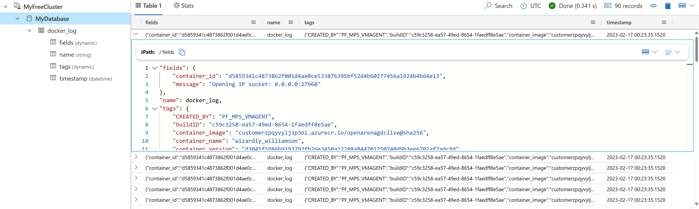

# Linux logs with telegraf and Azure Data Explorer (Kusto)

## Introduction

[Telegraf](https://github.com/influxdata/telegraf) is a plugin-driven server agent for collecting and reporting metrics. It supports a wide variety of inputs, processors, aggregators, and outputs.

[Azure Data Explorer (Kusto)](https://azure.microsoft.com/en-us/products/data-explorer/) is a fast, fully managed data analytics service that makes it easy to explore massive amounts of data at interactive speed using either a serverless or provisioned option. It is purpose-built for log analytics, application monitoring, infrastructure monitoring, and cybersecurity.

## What it does

This script grabs real-time logs from all containers running on the VM and sends them to Azure Data Explorer. Moreover, this script is applicable if you are running Linux MPS Builds using Linux containers for your game servers.

## Usage

You should the documentation for [telegraf Docker Logs input plugin](https://github.com/influxdata/telegraf/blob/master/plugins/inputs/docker_log/README.md) and [telegraf Azure Data Explorer output plugin](https://github.com/influxdata/telegraf/tree/master/plugins/outputs/azure_data_explorer) to learn more about the steps you need to do, specifically:

- Create a Kusto cluster and database to store the data ([click here for a free cluster](https://dataexplorer.azure.com/freecluster))
- Create an Azure Registered Application so that telegraf can authenticate to the cluster
  - [Register an application](https://docs.microsoft.com/en-us/azure/active-directory/develop/quickstart-register-app#register-an-application)
  - [Add a client secret](https://docs.microsoft.com/en-us/azure/active-directory/develop/quickstart-register-app#add-a-client-secret)
  - [Authorize the app in the database](https://docs.microsoft.com/en-us/azure/data-explorer/kusto/management/access-control/principals-and-identity-providers#azure-ad-tenants)
    - If you want telegraf to dynamically create tables, you should add this to the group "admins". If you want to create the tables manually, you should add this to the group "users" or "ingestors".

```kql
// Azure AD App on your tenant tenant - by tenant ID
.add database MyDatabase admins ('aadapp=<servicePrincipalApplicationID>;<tenantID>') 'Test app for telegraf'
```

- Table creation is optional, read the [telegraf Azure Data Explorer output plugin](https://github.com/influxdata/telegraf/tree/master/plugins/outputs/azure_data_explorer) for more details

You should grab the service Principal credentials (application/client ID, tenant ID and client secret) and apply them on telegraf.conf to configure the plugin. You should add the Azure Data Explorer (Kusto) cluster and database name on the same file.

Then, create a zip file with the following contents:

- config.conf
- PF_StartupScript.sh file
- telegraf assets (highly recommended)

You can now create a new MPS Build with your startup script using the [instructions here](https://learn.microsoft.com/en-us/gaming/playfab/features/multiplayer/servers/vmstartupscript).


