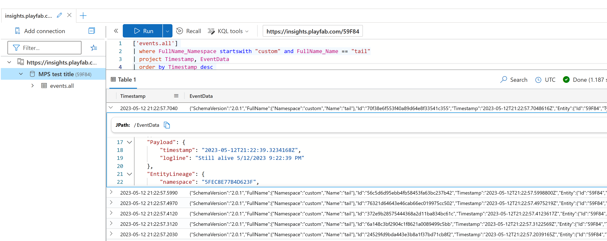

# Windows/Linux custom game server metrics

## Introduction

[Telegraf](https://github.com/influxdata/telegraf) is a plugin-driven server agent for collecting and reporting metrics. It supports a wide variety of inputs, processors, aggregators, and outputs.

## What it does

This script uses [telegraf](https://www.influxdata.com/time-series-platform/telegraf/) agent that sets up an HTTP server to listen for external metrics. Using this solution, you can send any kind of metrics from your game server to telegraf. You can use any of the [telegraf output plugins](https://github.com/influxdata/telegraf/blob/master/docs/OUTPUTS.md) to store them.

The documentation for the [http listener telegraf input plugin is here](https://github.com/influxdata/telegraf/blob/master/plugins/inputs/http_listener_v2/README.md).

You can see the [telegraf.conf](./telegraf.conf) file for an example of how to configure telegraf to listen for metrics on port 8080. To send metrics from your game server, you need to find the localhost IP address and send a POST request to the telegraf server.

### Host IP using Windows or Linux Processes

If you are using [process mode](https://learn.microsoft.com/en-us/gaming/playfab/features/multiplayer/servers/deploy-using-game-manager#server-details-for-process-mode), you can talk to telegraf using `localhost` or `127.0.0.1`.

### Host IP using Windows Containers

To get the IP of the host when using Windows Containers, you can use the following Powershell script from inside the container, before you start your game server:

```powershell
$gateway = (Get-WmiObject -Class Win32_IP4RouteTable | where { $_.destination -eq '0.0.0.0' -and $_.mask -eq '0.0.0.0' } | sort metric1 | select nexthop).nexthop
Write-Output $gateway
```

### Host IP using Linux Containers

To get the IP of the host when using Linux Containers, you can a script from inside the container, before you start your game server. The script you car run depends on your container image. If, for example, you are using Ubuntu, you can do `sudo apt update && sudo apt install net-tools` and then grab the gateway IP using:

```bash
netstat -rn | grep '^0.0.0.0' | awk '{print $2}'
```

```bash
curl -i -XPOST 'http://localhost:8080/telegraf' --data-binary 'cpu_load_short,host=server01,region=us-west value=0.64 1434055562000000000'
```

```powershell
$headers = @{
    "Content-Type" = "application/octet-stream"
}
$body = "cpu_load_short,host=server01,region=us-west value=0.64 1434055562000000000"
$response = Invoke-WebRequest -Uri "http://localhost:8080/telegraf" -Method POST -Headers $headers -Body $body
```

## Usage

You should download telegraf from the [GitHub releases](https://github.com/influxdata/telegraf/releases) section. The [Windows amd64 package](https://dl.influxdata.com/telegraf/releases/telegraf-1.24.4_windows_amd64.zip) works with this sample. Then, you should grab either the DeveloperSecretKey or the TelemetryKey from your PlayFab account and add it to the plugin.conf file.

Then, create a zip file with the following contents:

- telegraf.conf
- plugin.conf
- telegraf package file (e.g. telegraf.exe)
- PF_StartupScript.ps1 file

You can now create a new MPS Build with your startup script using the [instructions here](https://learn.microsoft.com/en-us/gaming/playfab/features/multiplayer/servers/vmstartupscript).


| :--: |
|Windows logs with telegraf and PlayFab|


