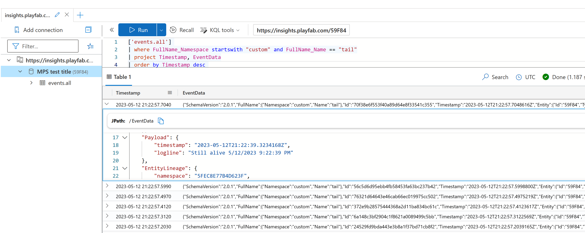

# Windows logs with telegraf and PlayFab

## Introduction

[Telegraf](https://github.com/influxdata/telegraf) is a plugin-driven server agent for collecting and reporting metrics. It supports a wide variety of inputs, processors, aggregators, and outputs.

[PlayFab](https://learn.microsoft.com/en-us/gaming/playfab/) contains a data environment, giving you instant access to your games data without the need for additional engineering. You can easily view the events on PlayFab Game Manager Data Explorer with [basic mode](https://learn.microsoft.com/en-us/gaming/playfab/features/insights/data-explorer/getting-started-with-data-explorer-basic) or [advanced mode](https://learn.microsoft.com/en-us/gaming/playfab/features/insights/data-explorer/getting-started-with-data-explorer-advanced).

You can see documentation about [Telegraf output plugin for PlayFab here](https://github.com/dgkanatsios/telegraftoplayfab). This plugin is an [external Telegraf plugin](https://github.com/influxdata/telegraf/blob/master/docs/EXTERNAL_PLUGINS.md).

## What it does

This script uses [telegraf](https://www.influxdata.com/time-series-platform/telegraf/) agent to grab game server logs emitted via the [Game Server SDK (GSDK)](https://github.com/playfab/gsdk) and send them to PlayFab. GSDK logs from game servers are written in paths `"D:\\GameLogs\\*\\GSDK_output_*.txt"`. Content in these text files is grabbed by the [tail](https://github.com/influxdata/telegraf/blob/master/plugins/inputs/tail/README.md) telegraf plugin and converted to proper telegraf metrics via the [grok](https://docs.influxdata.com/telegraf/v1.26/data_formats/input/grok/) format. Finally, the [Telegraf output plugin for PlayFab here](https://github.com/dgkanatsios/telegraftoplayfab) pushes these logs to PlayFab.

This script is applicable if you are running Windows MPS Builds using Windows game servers.

## Usage

You should download telegraf from the [GitHub releases](https://github.com/influxdata/telegraf/releases) section. The [Windows amd64 package](https://dl.influxdata.com/telegraf/releases/telegraf-1.24.4_windows_amd64.zip) works with this sample. Then, you should grab either the DeveloperSecretKey or the TelemetryKey from your PlayFab account and add it to the plugin.conf file.

Then, create a zip file with the following contents:

- telegraf.conf
- plugin.conf
- telegraf package file (e.g. telegraf.exe)
- PF_StartupScript.ps1 file

You can now create a new MPS Build with your startup script using the [instructions here](https://learn.microsoft.com/en-us/gaming/playfab/features/multiplayer/servers/vmstartupscript).

| :--: |
|Windows logs with telegraf and PlayFab|
