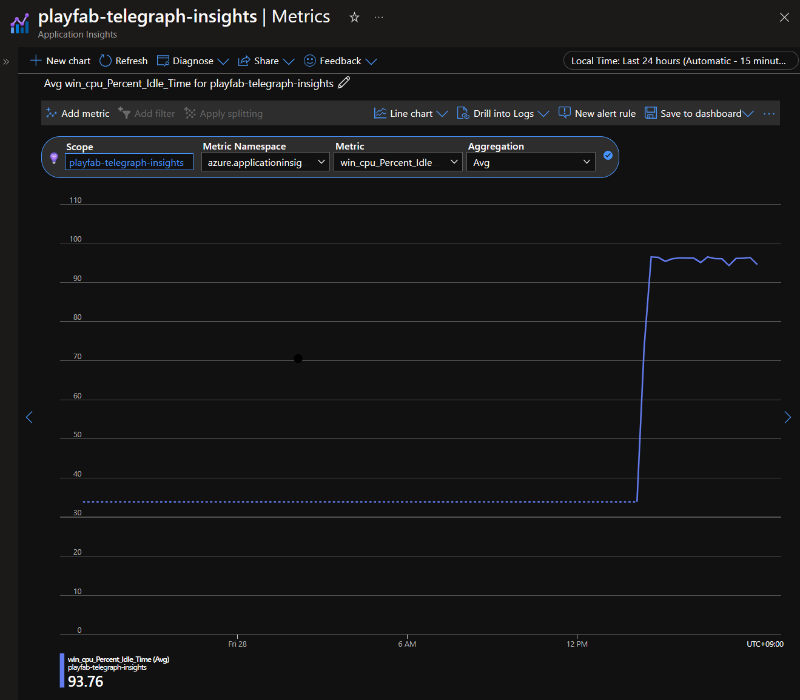

# Windows metrics with telegraf and Application Insights

## Introduction

[Telegraf](https://github.com/influxdata/telegraf) is a plugin-driven server agent for collecting and reporting metrics. It supports a wide variety of inputs, processors, aggregators, and outputs. 

[Application insights](https://learn.microsoft.com/en-us/azure/azure-monitor/app/app-insights-overview) helps you maximize the availability and performance of your applications and services. It delivers a comprehensive solution for collecting, analyzing, and acting on telemetry from your cloud and on-premises environments. This information helps you understand how your applications are performing and proactively identify issues that affect them and the resources they depend on.

You can see documentation about Application Insights output telegraf plugin [here](https://github.com/influxdata/telegraf/blob/master/plugins/outputs/application_insights/README.md).

## What it does

This script uses [telegraf](https://www.influxdata.com/time-series-platform/telegraf/) agent to send VM metrics to Application Insights. The telegraf agent publishes [custom metrics](https://docs.microsoft.com/en-us/azure/azure-monitor/platform/metrics-custom-overview) using the Azure Monitor REST API. Custom metrics are available in these [regions](https://docs.microsoft.com/en-us/azure/azure-monitor/platform/metrics-custom-overview#supported-regions).

This script is applicable if you are running Windows MPS Builds using Windows containers or processes for your game servers.

The result is almost the same as [Windows metrics with telegraf and Azure Monitor](../windows_metrics_telegraf_azuremonitor/README.md).
But there is no need to prepare a dummy VMSS.
Instead, creating an Application Insights resource.

## Usage

You should download telegraf from the [GitHub releases](https://github.com/influxdata/telegraf/releases) section. The [Windows amd64 package](https://dl.influxdata.com/telegraf/releases/telegraf-1.24.4_windows_amd64.zip) works with this sample.
Then, you should create a [Application Insights](https://learn.microsoft.com/en-us/azure/azure-monitor/app/app-insights-overview) resource in your subscription.
Copy the Instrumentation key from the Overview of the Application Insights resource you created and paste it into the telegraf.conf file.

Add these values to the PF_StartupScript.ps1 file. Then, create a zip file with the following contents:

- telegraf.conf
- telegraf package file (e.g. telegraf.exe)
- PF_StartupScript.ps1 file

You can now create a new MPS Build with your startup script using the [instructions here](https://learn.microsoft.com/en-us/gaming/playfab/features/multiplayer/servers/vmstartupscript).

| :--: |
|Windows metrics with telegraf and Application Insights|
