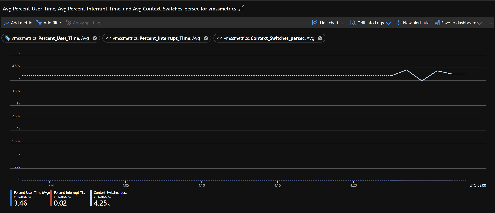

# Windows metrics with telegraf and Azure Monitor

## Introduction

[Telegraf](https://github.com/influxdata/telegraf) is a plugin-driven server agent for collecting and reporting metrics. It supports a wide variety of inputs, processors, aggregators, and outputs. 

[Azure Monitor](https://learn.microsoft.com/en-us/azure/azure-monitor/overview) helps you maximize the availability and performance of your applications and services. It delivers a comprehensive solution for collecting, analyzing, and acting on telemetry from your cloud and on-premises environments. This information helps you understand how your applications are performing and proactively identify issues that affect them and the resources they depend on.

You can see documentation about Azure Monitor output telegraf plugin [here](https://github.com/influxdata/telegraf/tree/master/plugins/outputs/azure_monitor/README.md).

## What it does

This script uses [telegraf](https://www.influxdata.com/time-series-platform/telegraf/) agent to send VM metrics to Azure Monitor. The telegraf agent publishes [custom metrics](https://docs.microsoft.com/en-us/azure/azure-monitor/platform/metrics-custom-overview) using the Azure Monitor REST API. Custom metrics are available in these [regions](https://docs.microsoft.com/en-us/azure/azure-monitor/platform/metrics-custom-overview#supported-regions).

This script is applicable if you are running Windows MPS Builds using Windows containers or processes for your game servers.

## Usage

You should download telegraf from the [GitHub releases](https://github.com/influxdata/telegraf/releases) section. The [Windows amd64 package](https://dl.influxdata.com/telegraf/releases/telegraf-1.24.4_windows_amd64.zip) works with this sample.
Then, you should open a new [Azure Monitor](https://learn.microsoft.com/en-us/azure/azure-monitor/overview) and grab the instrumentation key. You should add this key to the telegraf.conf file.

You should create an Azure resource where the Azure Monitor metrics will be published to. For our sample, we created a VMSS (Virtual Machine Scaleset resource) with 0 Virtual Machines (so there is no compute charge) but a single VM in the deallocated state could also work. Once you do that, you should copy the resource ID and add it to the telegraf.conf file.

We need telegraf to be able to authenticate to Azure Monitor on your subscription so it can post the metrics. Use the [Azure CLI](https://docs.microsoft.com/en-us/cli/azure/) to create a service principal with the "Monitoring Metrics Publisher" role for the subscription that metrics will be published against (subscription ID can be retrieved using `az account list` or from the Azure portal):

```bash
az ad sp create-for-rbac --role="Monitoring Metrics Publisher" --scopes="/subscriptions/<replace-with-subscription-id>"
```

On success, the output will look similar to:

```json
{
    "appId": "xxx",         // AZURE_CLIENT_ID
    "displayName": "xxx",
    "name": "xxx",
    "password": "xxx",      // AZURE_CLIENT_SECRET
    "tenant": "xxx"         // AZURE_TENANT_ID
}
```

Add these values to the PF_StartupScript.ps1 file. Then, create a zip file with the following contents:

- telegraf.conf
- telegraf package file (e.g. telegraf.exe)
- PF_StartupScript.ps1 file

You can now create a new MPS Build with your startup script using the [instructions here](https://learn.microsoft.com/en-us/gaming/playfab/features/multiplayer/servers/vmstartupscript).


